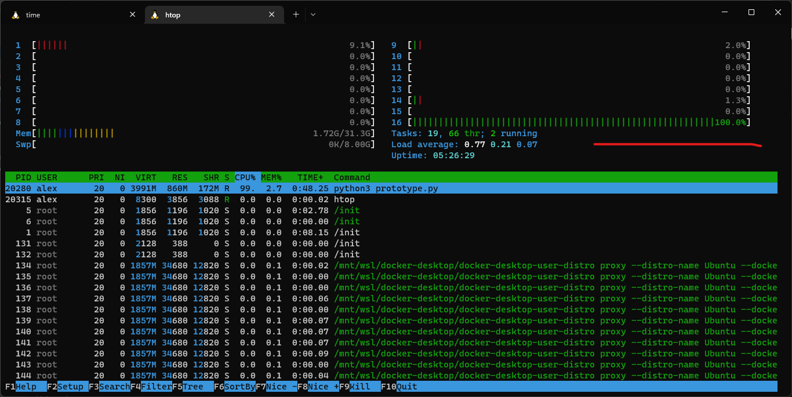
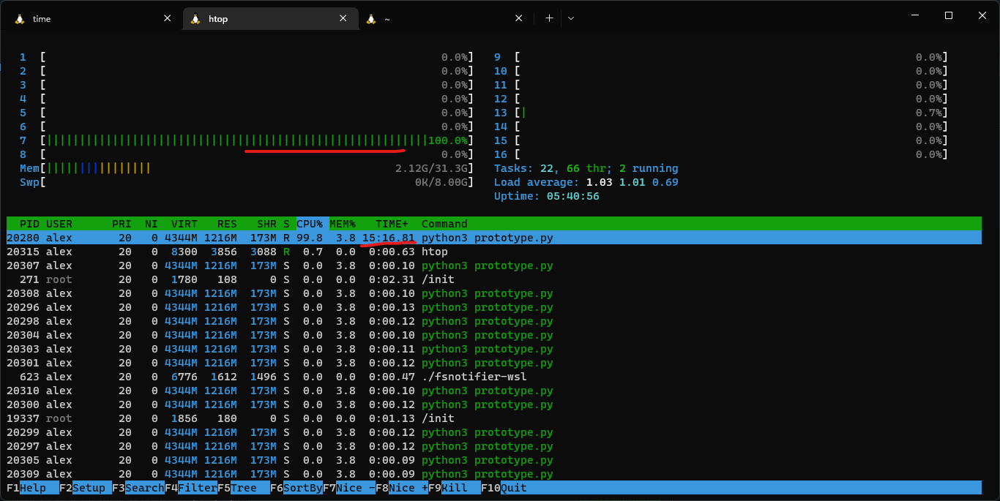
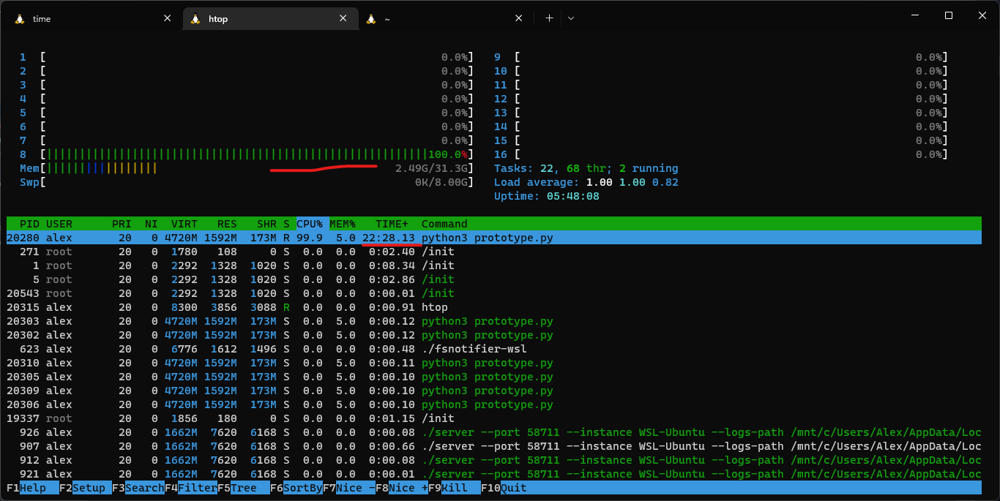
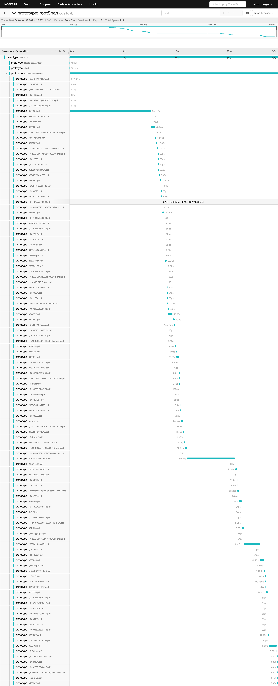

# Performance measurements

These measurements are mostly concentrated on processing part of the program.

## Avg running time of the program 

### Local test 

Testing machine: Intel i7-10700k, 64GB Ram, 1TB ssd drive
OS: Windows 11 Pro
Running Environment: WSL 2 Ubuntu 20.04
Running Environment Limits: Memory 32 Gb RAM

Run 1: 26m32s

Run 2: 26m50s

Run 3: 26m27s

Run 4: 26m48s

Avg: 26m39s

### Cirrus test 

Cirrus profile:

```bash
#SBATCH --job-name=psd-assessment-piekhota
#SBATCH --time=0:30:0
#SBATCH --exclusive
#SBATCH --nodes=1
#SBATCH --tasks-per-node=1
#SBATCH --cpus-per-task=36

#SBATCH --account=m22oc-S2456499
#SBATCH --partition=standard
#SBATCH --qos=standard
```

Run 1: 42m07s

Run 2: 41m36s

Run 3: 38m17s

Run 3: 41m54s

Avg: 40m58s

Avg calculations were made by using this 
website: [http://www.csgnetwork.com/timescalc.html](http://www.csgnetwork.com/timescalc.html)

### Avg running time of the program Summary

Running on Cirrus (averagely 40m58s) takes longer time than running locally(averagely 26m39s). Having a lot of cpus(in case of cirrus - very powerful cpus) is not helping cirrus 
to show better results. Amount of memory won't make any difference as well. Something that supposed to be
faster on local machine is the ssd drive. It is nvme drive and it is not shared as it is on cirrus machines.
That is why we can make an assumption that disk reading and writing operations are very important in terms
of performance.

## CPU Usage 

To go even further with understanding what is going in with our program we decided to use `htop` to track
cpu usage during the program execution. 
As we know the avg running time of the program we can take several snapshots of the system to compare how 
the program utilises the system resources. 

### Local test 

Testing machine: Intel i7-10700k, 64GB Ram, 1TB ssd drive
OS: Windows 11 Pro
Running Environment: WSL 2 Ubuntu 20.04
Running Environment Limits: Memory 32 Gb Ram

During the program execution we did several snapshots of the system to compare the utilization. 
3 figures were made to demonstrate the result: 

1. The first figure was made in the begging of the process (48s).

2. The second figure was made in the middle of the process (15m 16s).

3. The third figure was made close to the end of the process (22m 28s).


### CPU Usage summary 

As can be seen from the pictures above we can definitely say that our program can take advantage of 
multicore machine. We see that during all period our program was processed by only one cpu and all other 
cpus wasn't used at all. This lead to the conclusion that the program is written in a not optimal way as
we have many input files that can be handled in parallel

## Program Tracing

In addition to tests above we decided to use a special tool, called `opentelemetry`, to understand and measure
the performance of each block of our program.

For this reason the original code of the program was updated in order to support that functionality.
Code changes can be seen in this pull request: 
[Jones__Jefferson_and_Rivera/-/merge_requests/2/diffs](https://git.ecdf.ed.ac.uk/psd2223/Jones__Jefferson_and_Rivera/-/merge_requests/2/diffs)

Tracing results are presented in this figure: 



### Tracing summary

This execution took a little longer as computing test machine was also busy by running different computation. 
However, it is still relevant to understand trends. 

The block of code that marked as mainExecutionSpan was taken the largest amount of time. Therefore, most of our 
speed optimisations have to be focused on this part in the future. 
Also, we can see that files `3529258.pdf`, `s13030-019-0164-1.pdf`, `2989081.2989121.pdf` had been processed more 
time than any other files.  
