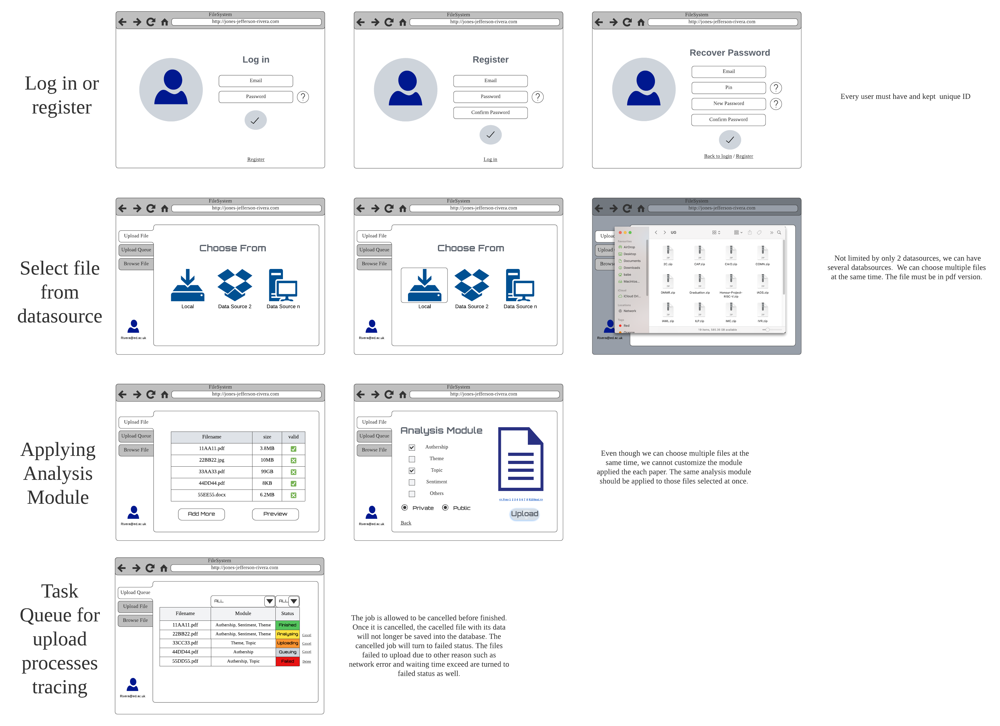
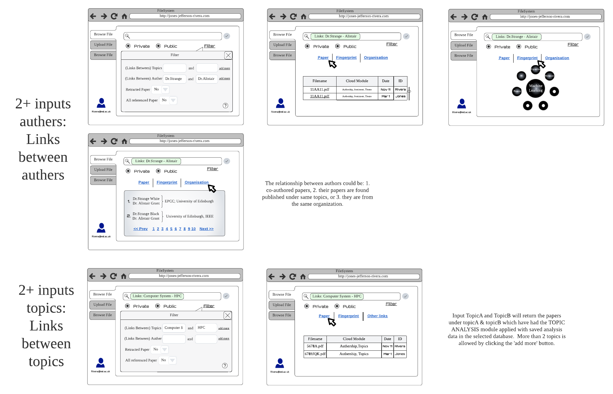
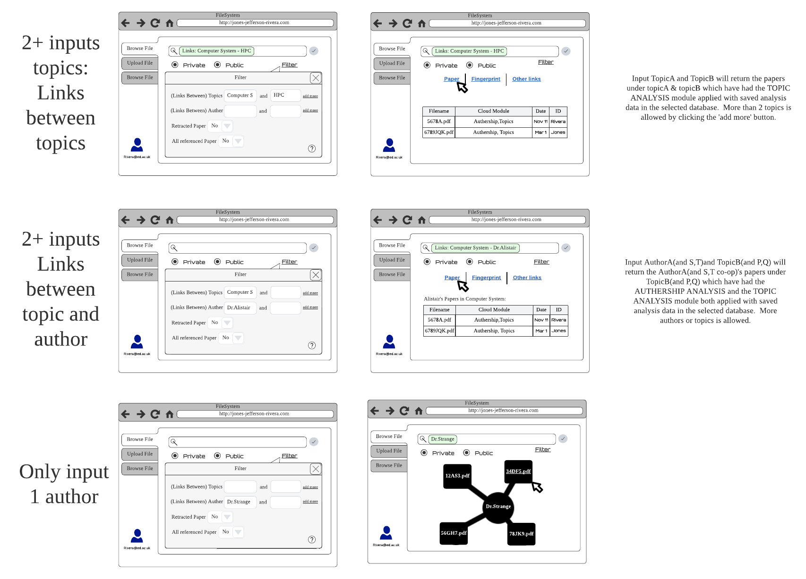

# Initial requirements decomposition

For the Summative Group Assessment 1 our team decided to follow agile project management approach.
The decomposition for the [requirements](./1-intro.md) is shown below.  

**Theme/Initiative:**
1. Develop a system for the analysis of academic papers and other sources (e.g., news articles)

**Epics:**
1. Allow researchers and/or analysts to ingest academic and other source articles into a data store 
for running analysis queries targeting the information and metadata collated about the papers.
2. The solution should provide a method to enable different visualisations of the results, from textual to graphical, 
supporting interactive analysis and near-real-time query processing on the data store.

**Prioritisation:**
We decided not to use prioritisation systems like MoSCoW or HiPPO. Instead, we used simple prioritisation: high, medium, and low. Such an approach would reduce complexity and allow us to move faster.

**Epic 1 (Allow researchers and/or analysts to ingest academic and other source articles into a data store
for running analysis queries targeting the information and metadata collated about the papers) Stories:**

The most important functions for users is to store information and do the analysis queries. Therefore, other functions apart from the main functions can be set with medium or low priority. For instance, the functions with account settings are not as important as information storing and analysis queries.

| Title                                                        | Priority |
| ------------------------------------------------------------ | :------: |
| As a user, I should be able to login into the system.        |   high   |
| As a user, I should be able to create an account to log in into the system. |   low    |
| As a user, I should be able to restore a password in case I can't log in. |   low    |
| As an researchers and/or analysts, I should be able to upload a pdf paper into the system from local disk. |   high   |
| As an researchers and/or analysts, I should be able to upload a pdf paper into the system from dropbox. |   high   |
| As an researchers and/or analysts, I want an ability to add additional data sources to upload data from. |   high   |
| As an researchers and/or analysts, I should be able to upload multiple documents in the same time. |  medium  |
| As an researchers and/or analysts, I should be able to upload a pdf paper into the system from aws s3. |   high   |
| As an researchers and/or analysts, I should be able to see an error if the paper has wrong extension. |  medium  |
| As an researchers and/or analysts, I should be able to see the list of all documents uploaded before. |  medium  |
| As an researchers and/or analysts, I should be able to see the status of each document while it is processed by the system. |   low    |
| As an researchers and/or analysts, I should be able to sort documents list by its name in ASC and DESC order and the same for document status. |  medium  |
| As an researchers and/or analysts, I should be able to search documents in documents list. |   high   |

**Non functional requirements:**

| Title                                                                                                      | Priority |
|------------------------------------------------------------------------------------------------------------|----------|
| System should not allow upload files larger than 25mb.                                                     |  medium  |
| Uploading module has to support extensible architecture to have an opportunity to add new sources of data. |  medium  |
| The process of extracting data from papers, news, articles should be done via message queues architecture. |   low    |

In regard to the requirements above the following design were made:  More details about the design and some explanations can be found in [the part 3 of the report](./3-approached-ui-design.md). 

**Epic 2 (Develop a method to enable different visualisations of the results, from textual to graphical,
supporting interactive analysis and near-real-time query processing on the data store) Stories:**

The main functions is to use simple language query to visualise the query data. Other functions apart from the main functions can be set with medium or low priority. For instance, some functions like sharing visualisation data is less important than data visualisation frunctions.

| Title                                                        | Priority |
| ------------------------------------------------------------ | :------: |
| As an researchers and/or analysts, I should be able to query the data in the SQL language. |   high   |
| As an researchers and/or analysts, I should be able to visualize the data as a table, line chart and bar chart. |   high   |
| As an researchers and/or analysts, I should be able to save the visualization results as a visualisation dashboard and be able to return to that dashboard later. |  medium  |
| As an researchers and/or analysts, I should be able to have multiple dashboards. |  medium  |
| As an researchers and/or analysts, I should be able to share a visualisation dashboard to other users. |   low    |
| As an researchers and/or analysts, I need to be able to query clusters of papers around topics. |   high   |
| As an researchers and/or analysts, I have to be able to query links between authors. |   high   |
| As an researchers and/or analysts, I have to be able to get links between topics. |   high   |
| As an researchers and/or analysts, I have to be able to get links between authors and topics. |   high   |
| As an researchers and/or analysts, I have to be able to get results of sentiment analysis. |   high   |
| As an researchers and/or analysts, I have to be able to get paper outcomes. |   high   |
| As an researchers and/or analysts, I have to be able to get retractions. |  medium  |
| As an researchers and/or analysts, I have to be able to get paper reference networks. |   high   |
| As an researchers and/or analysts, I have to be able to get timeline. |   high   |

In regard to the requirements above the following design were made: 
 
 
 
 

More details about the design and some explanations can be found in [the part 3 of the report](./3-approached-ui-design.md). 

**Non functional requirements:**

| Title                                                        | Priority |
| ------------------------------------------------------------ | :------: |
| System has to support a flexible database layer and have an opportunity to add additional databases for different analysis. |  medium  |

**System wide Non functional requirements:**

These non-functional requirements are not as necessary as the previous main functions. However, some requirements should also be considered like time consuming and generalisation of different formats. 

| Title                                                        | Priority |
| ------------------------------------------------------------ | :------: |
| Each component of the system has to be fault tolerant.       |  medium  |
| Each component of the system has to share its system information, so it could be analysed by developers and administrators. |  medium  |
| The processing module has to share tracing information, so it could be analysed in central place. |   low    |
| All the queries made in analysis module should be saved for further analysis and performance improvements. |   high   |
| Each request to Ingest articles Module has to be no longer that 1s. |  medium  |
| The papers processing pipeline has to be done via queues approach. |  medium  |
| The papers processing worker has to be able to scale when the amount of documents increases. |  medium  |
| All the services have to support availability 99.9999.       |   high   |
| All the data in databases and on the shared disk must be backed up 2 times per day. |  medium  |
| Each service has to be health checked every 30 seconds and notify the system administrator if the health check fails. |   low    |
