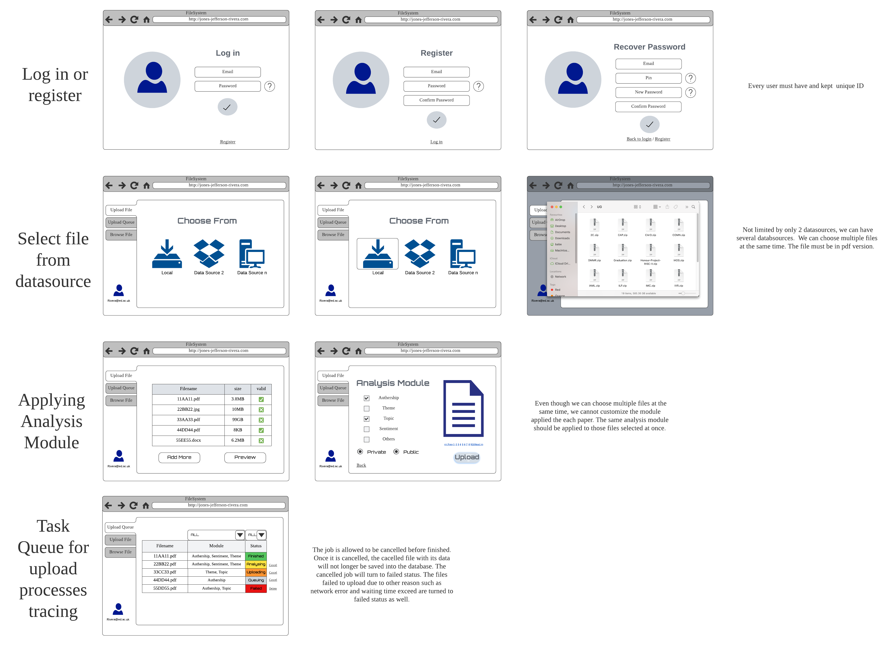
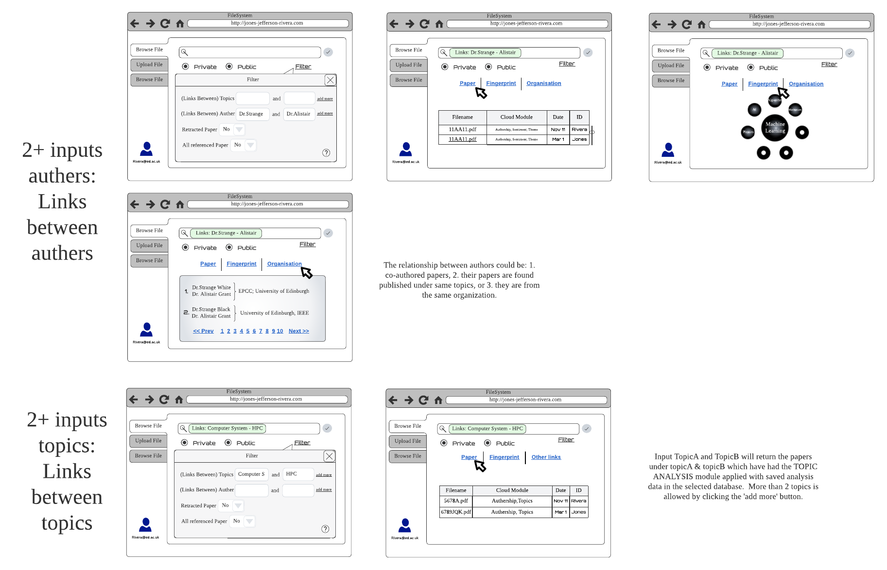
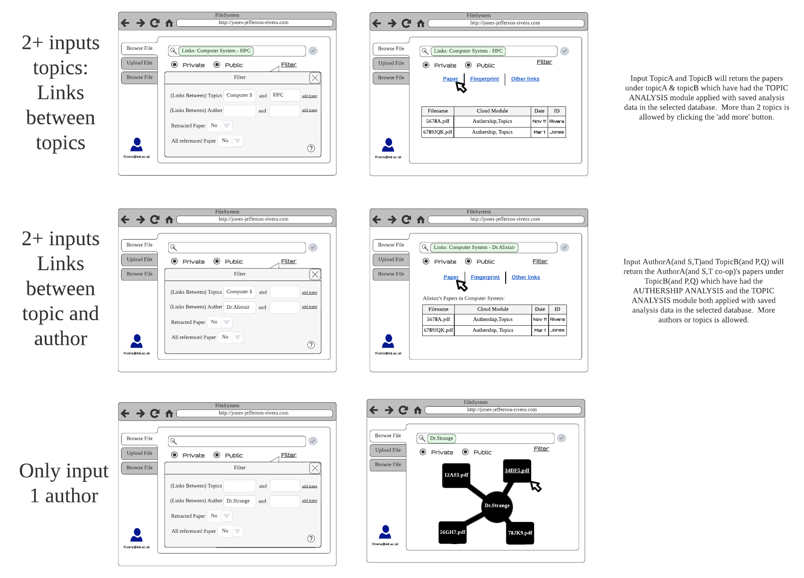
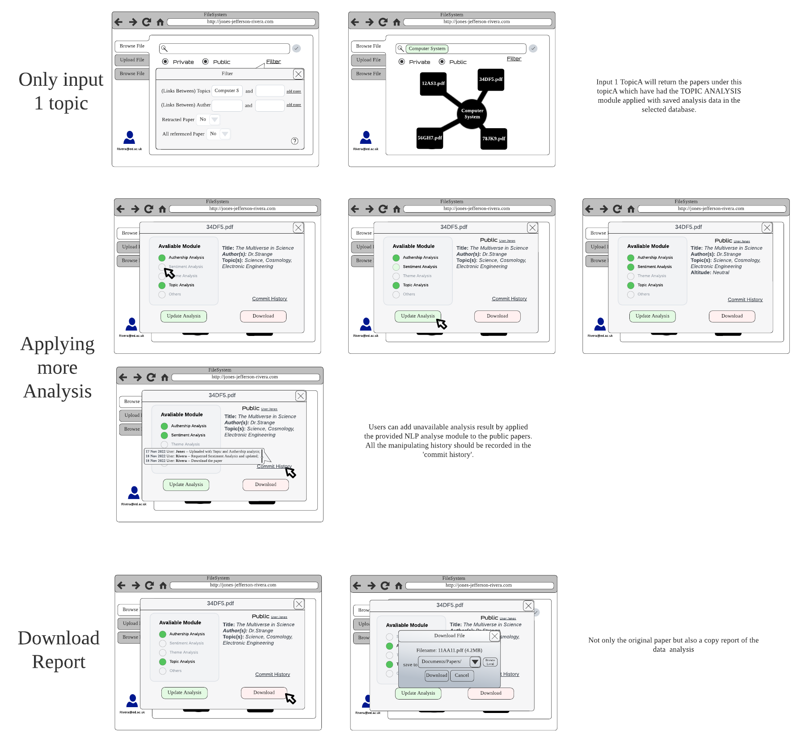
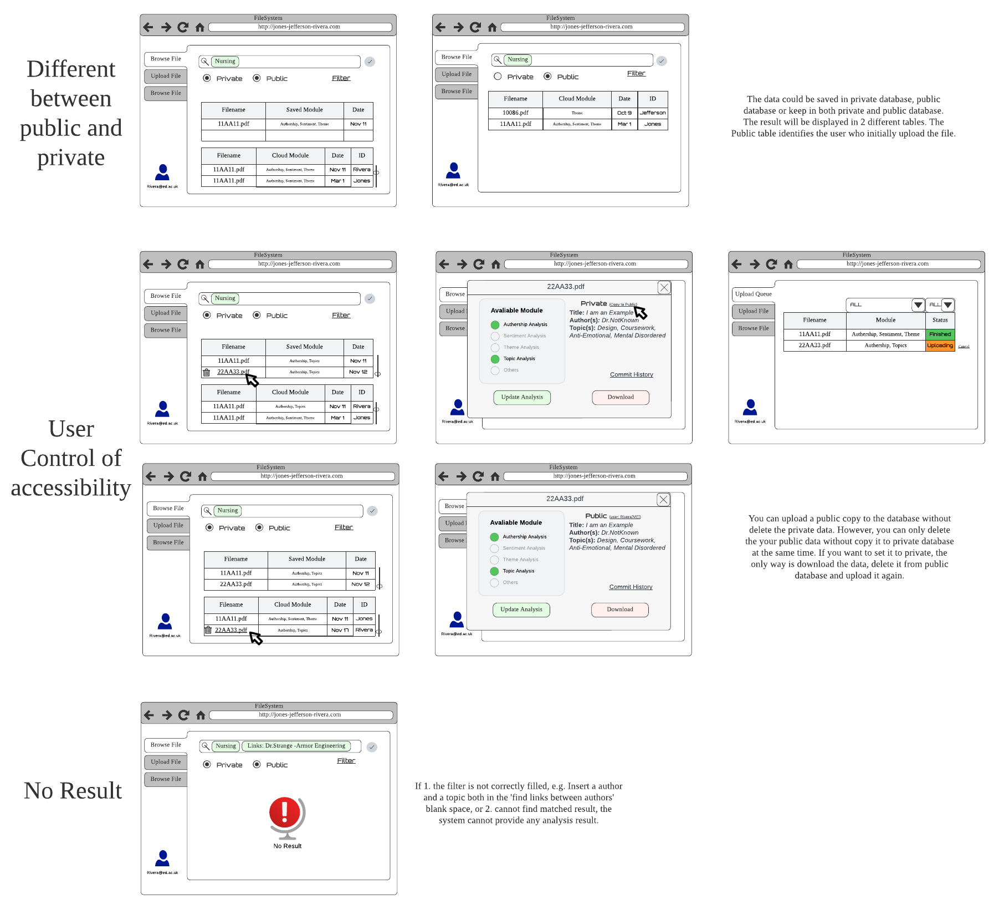

According to the initial requirements decomposition the following ui design was developed. All the UI design details are summarised in [UI_Design_Specification](./images/PSD-Assessment1-UI.pdf).

## Epic 1 UI Design:

### Part 1 of UI Designs Specification:

1. The user can log in with email and password or he/she can also register a new account. If the user forgets the password, he/she can click "forget the password" to recove password. Every user must have and kept unique ID.

2. As the user log in the system, he/she can upload fils from local or other data sources. Not limited by only 2 datasources, we can have several databsources. We can choose multiple files at the same time. The file must be in '.pdf' version.

3. Even though we can choose multiple files at the same time, we cannot customize the module applied the each paper. The same analysis module should be applied to those files selected at once.
  
4. The user can check the previously uploaded data which has been stored in the private/public database. 

5. The job is allowed to be cancelled before finished. Once it is cancelled, the cacelled file with its data will not longer be saved into the database. The cancelled job will turn to failed status. The files failed to upload due to other reason such as network error and waiting time exceed are turned to failed status as well. 
 

## Epic 2 UI Design:
### Part 2 of UI Designs Specification:

1. If the user wants to link between two authors, he/she can click the filter button to input the name of the authors and other useful information. The relationship between authors could be: 1. co-authored papers, 2. their papers are found published under same topics, or 3. they are from the same organization. 

2. If the user wants to link two topics, he/she can clikc the filter button to input the topic names and other useful information. The searching results will show the papers containing both two topics. Input TopicA and TopicB will return the papers under topicA & topicB which have had the _TOPIC ANALYSIS- module applied with saved analysis data in the selected database.  More than 2 topics is allowed by clicking the 'add more' button. 

3. The search of links between authors and topics is also allowed. Input AuthorA(and S,T)and TopicB(and P,Q) will return the AuthorA(and S,T co-op)'s papers under TopicB(and P,Q) which have had the _AUTHERSHIP ANALYSIS_ and the _TOPIC ANALYSIS_ module both applied with saved analysis data in the selected database.  More authors or topics is allowed. 

4. If the user only input one author, the result will show a cluster of papers authored by him/her, or has refered his papers. The papers must have had the _AUTHORSHIP ANALYSIS_. 

5.  As same as for input one topic, Input TopicA will return the papers under this topicA which have had the _TOPIC ANALYSIS_ module applied with saved analysis data in the selected database.

6. Users can request unavailable analysis result by applied the provided NLP analyse module to the public papers. All the manipulating history should be recorded in the 'commit history'. 

7. As the user finds the file he/she wants, he/she can download the file to have a further check, not only the original paper but also a copy report of the data analysis.

8. The data could be saved in private database, public database or keep in both private and public database. The result will be displayed in 2 different tables. The Public table identifies the user who initially upload the file.
 
9. The users can control the accessibility of his private data or the public data he uploaded. He/she can push his/her private copy to the public database without delete the private data. However, you can only delete the public data without copy it to private database at the same time. If you want to set it to private, the only way is download the data, delete it from public database and upload it again.
 
10. The system should notice the user if there is no search result. If 1. the filter is not correctly filled, e.g. Insert a author and a topic both in the 'find links between authors' blank space, or 2. cannot find matched result, the system cannot provide any analysis result.  
