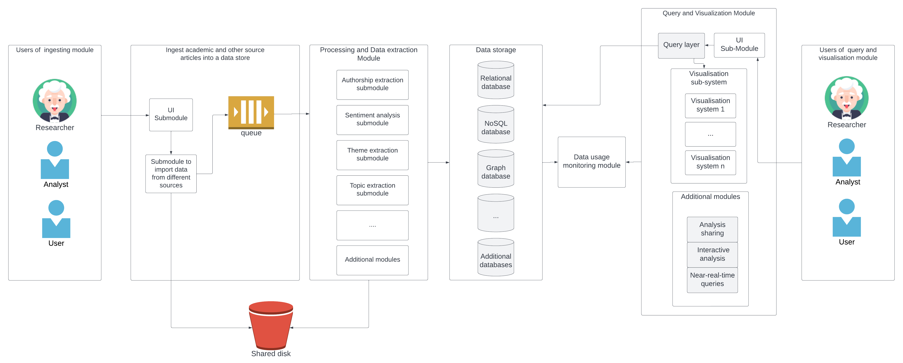

According to all the requirements above the following high lever architecture schema was developed:

#   Requirements and module analysis

1. Requirement: Ingest academic and other source articles into a data store

Module related:
- Users of ingesting module
- UI submodule
- Submodule to import data from different sources

Explanation:

The users of ingesting module have different users including researcher, analyst, and normal user. 
Each user has different authority of ingesting function. The UI submodule and submodule to import data from 
different sources allowed user to ingest other source articles. These articles will be stored in the shared disk 
with original form and pushed into the queue to do different types of analyzation. Data of analytics-ready form 
will be stored in different data storage.

2. Requirement: Running analysis queries targeting the information and metadata collated about the papers

Module related:
- Query and visualization module (Query layer and UI Sub-Module)
- Users of query and visualization module
- Data storage		

Explanation:

The users of query and visualization module have different users including researcher, analyst, and normal user. 
Each user has different authority of query function. The analysis queries will be applied in query layer targeting 
the data of analytics-ready form stored in the different data storage.

3. Requirement: Enable different visualizations of the results 

Module related: 
- Query and Visualization Module (visualization sub-system)

Explanation:

Visualization sub-system has different module of view (from visualization system 1 to visualization system n including 
textual view and graphical view etc), users can select different view of the result. 
The result data would be extracted from the data storage through data usage monitoring module to the visualization 
system.

4. Requirement: Support additional analysis 

Module related: 
- Query and Visualization Module (Additional modules)

Explanation:

Additional modules include analysis sharing, interactive analysis, and near-real-time queries etc. 
the analysis sharing and the interacticve analysis module allowed users to publicize analysis outputs and 
share common analysis pipelines. 

5. Requirement: Monitoring data usage 

Module related: 
- data usage monitoring module

Explanation: 
Data usage monitoring module would monitor the data flow and record query time. 
Aiming to optimize data storage and different query types.

