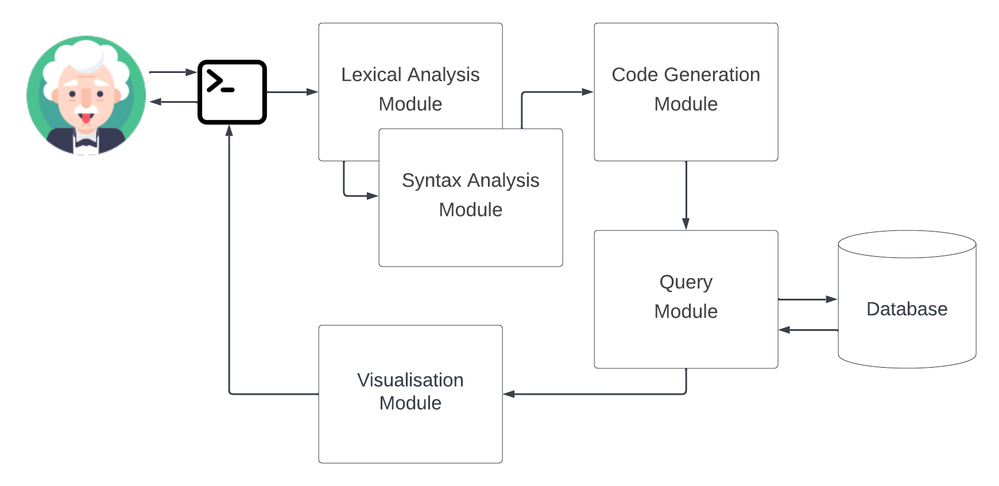
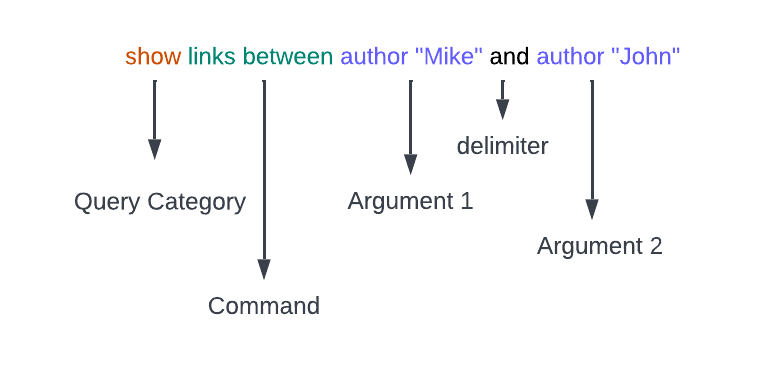
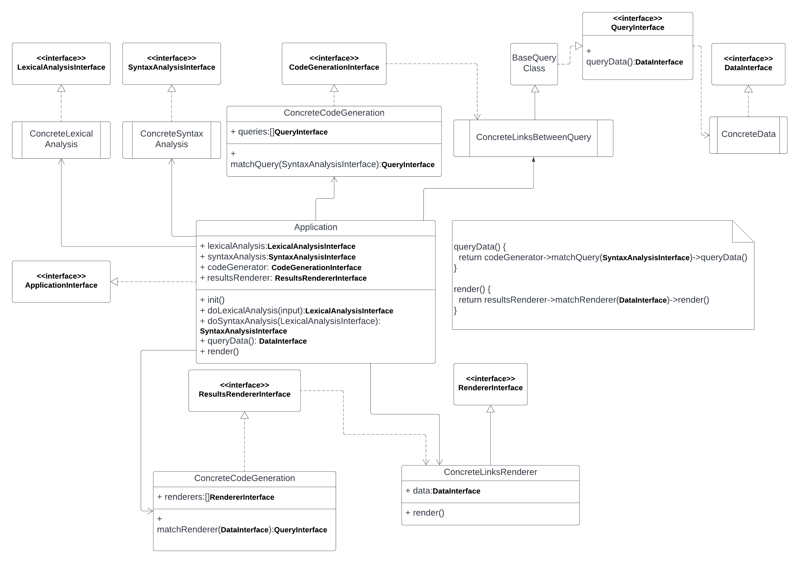
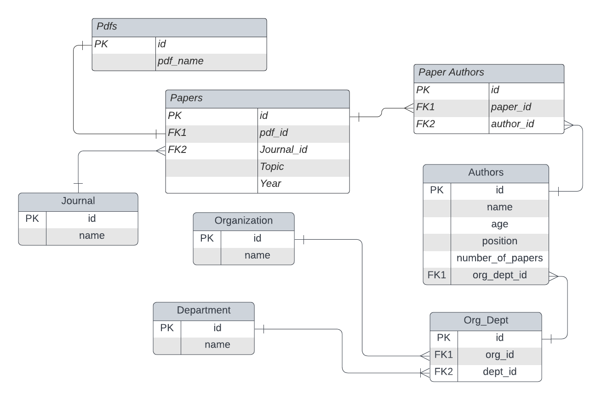
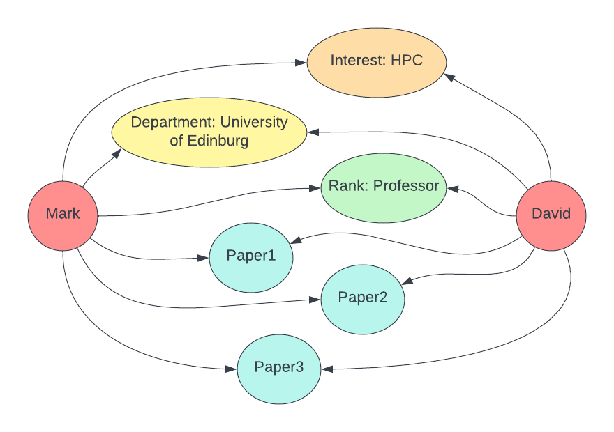

# Design, Language and Technology Choices

## High level architecture schema  



This architecture schema is quite easy to follow and to understand. It shows the entrypoint 
for the user is a terminal application and how the data flows across the system. 

This schema demonstrates the way on how 2 epics are approached in our design:
- Develop a query language that is able to handle different analytical queries.
- Develop a module to visualize different queries in different formats.

We introduced the lexical, syntax and code generation modules. The result of the user input is going to
be converted into a format that than can be passed into a Query Module to get proper data for the user. 
Output of all the queries needed to get the user data is passed into visualisation module and return
to user in proper way.

## Technology Choices

### Databases, that were compared 

---

#### SQLite

Pros:

- Is suitable for simple use cases.
- Easy to start with.

Cons: 
- It has no sophisticated optimizer or query planner.                                                     
- For large databases the query requirements become complicated, the cost of time and money will increase.
- Unclear how to handle concurrent access, data locks, scaling.                                             

Summary: Good for local development or prototyping. Definitely not the best choice for the production system. 

--- 

#### MongoDB

Pros: 
- schema-less. If you have a flexible schema, this is ideal for a document store like MongoDB. This is difficult to implement in a performant manner in RDBMS
- ease of scale-out. Scale reads by using replica sets. Scale writes by using sharding (auto balancing). Just fire up another machine and away you go. Adding more machines = adding more RAM over which to distribute your working set.
- cost. Depends on which RDBMS of course, but MongoDB is free and can run on Linux, ideal for running on cheaper commodity kit.
- you can choose what level of consistency you want depending on the value of the data (e.g. faster performance = fire and forget inserts to MongoDB, slower performance = wait til insert has been replicated to multiple nodes before returning)

Cons:
- Data size in MongoDB is typically higher due to e.g. each document has field names stored it
- less flexibity with querying (e.g. no JOINs)
- no support for transactions - certain atomic operations are supported, at a single document level
- at the moment Map/Reduce (e.g. to do aggregations/data analysis) is OK, but not blisteringly fast. So if that's required, something like Hadoop may need to be added into the mix
- less up to date information available/fast evolving product

Source: [Pros and cons of MongoDB?](https://stackoverflow.com/questions/5244437/pros-and-cons-of-mongodb)

Summary: As a team we do not have many production experience with mongodb. Even though it can be
a good database solution we're afraid to get into unpredictable problems during prototype development.

---

#### PostgreSQL

Pros:
- Open source
- Highly expandable
- Largely compliant with SQL standard
- Possible to process complex data types (e.g. geographical data)
- Flexible full text search
- Creation of own functions, triggers, data types, etc. possible
- Good language support (Python, Java, Perl, PHP, C, C++, etc.)
- Supports JSON
- Cross-platform

Cons:
- Not available on all hosts by default
- Expandable documentation only available in English
- Comparatively low reading speed
- Higher complexity comparing to MySQL

Source: [PostgreSQL: a closer look at the object-relational database management system](https://www.ionos.co.uk/digitalguide/server/know-how/postgresql/)

Summary: We would suggest to implement this database as the next step after POC, however, as initial
start we prefer MySQL

--- 

#### MySQL

Pros:
- MySQL is open source without copyright restrictions.              
- MySQL is a high-performance and relatively simple database system.
- Good understanding of the data structure.                         
- Still can be easily replaced if needed.                           

Cons:
- Not the best choice for graph queries.   
- Not as good as mongodb for json queries.

Summary: We are definitely sure that we can deliver a working prototype with the given database.   

### Languages, that we compared

#### C
Pros:
- C language has a wide range of operations.
- Basic building block.
- Rich in library functions.

Cons:
- C is lack of objext-oriented programming's concepts and it will take much time to do encapsulation.
- The cost of time in learning this language is high.
- C needs to be coded more than other languages in implementing same functions.

Summary: Will be too complicated for this task to use. Too many risks.   

---
#### Java
Pros:
- Java is good for object-oriented programming.
- Java is highly structured.
- For sustainability, Java is easy and cheep to maintain.

Cons:
- Java is slow and has a poor performance.
- Java does not provide attractive look and feels of GUI.
- Java requires significant memory space.

Summary: The team is less familiar with Java comparing to Python. Therefore, Java is not a good choice here.  
---
#### Golang
Pros:
- Golang is easy to learn.
- Golang's programmes can be instantly changed and executed.

Cons:
- its Dependency management is flawed.
- Golang doesn’t have many libraries or information.
- Underlying contradictions make its simplicity appear flimsy.

Summary: Quite interesting choice, but the team is not familiar with this language as well. 
---
#### Python

Pros
- Every group member is familiar with the tool.
- Many text parsing libraries available.        
- Many libraries for work with terminal.        
- Many database connectors.                     

Cons
- Will take more memory recourse and also cost more time, compared with C, C++ and Java.
- Interpreted nature of the language can lead to non-obvious bugs.

Summary: Even though the language has it's own cons, it would be a good choice for the POC.

### Application formats, that we compared

#### Windows, Mac, Linux Ui based application

##### Windows
Pros:
- The system is easy to be fixed.
- It has a good hardware compatibility.

Cons:
- The configuration environment is very troublesome.
- Windows has a low level of terminal.


##### Mac
Pros:
- Mac is friendly to users to use.
- Mac has a good UI design.
- Mac contains a good terminal system.

Cons:
- Software suitable to Mac is not as many as Windows environment.
- It is inadequate with computing proficiency.


##### Linux
Pros:
- It is free to use.
- It is open-source.
- It contains a high level of customization.
- It has a high security and stability.

Cons:
- The time consuming of learning is high.

Summary: The complexity and time effort for the approach that involves OS UI development will be too high 
for us. Therefore, we need to find something easier for the POC.

---
#### Web application
Pros:
- Data can be stored on cloud.
- It is cheap to maintain.
- The visualisation is friendly to users.

Cons
- The implementation will take a long time.
- The system should have good connections with front-end, back-end and database.

Summary: Team is not very familiar with web development. We would spend some additional time working on WEB 
integration. Good ui requires Javascript knowledge that our team doesn't have. 

---
#### Console/Terminal application

Pros
- Easy to start with and demonstrate query example.                    
- No need to worry about UI part.                                      
- Easy to implement with Python3.                                      
- Can be shared as Python module and able to run on different machines.

Cons
- Visualization can be problematic.             
- Less autocompletion options.                  
- Can be difficult for some users to work with.

Summary: very nice option for initial POC: simple, easy to start with, still able to demonstrate the program features.

### Desired technology stack

According to the comparative analysis above we decide to develop our prototype using the following 
technologies:

Database: MySQL8
Language: Python3
Application type: Console Application

## Query Language Specification 



AST Example:
```json
{
  "type" : "statement",
  "variant" : "list", 
  "statement" : [
    {
      "type": "statement",
      "variant": "show",
      "links": [
        {
          "type": "expression",
          "variant": "author",
          "expression": {
            "type": "identifier",
            "variant": "author_name",
            "name": "Mike"
          }
        },
        {
          "type": "expression",
          "variant": "author",
          "expression": {
            "type": "identifier",
            "variant": "author_name",
            "name": "John"
          }
        }
      ]
    } 
  ]
}
```

The presented structure follows initial requirements:

- All the queries has to be done in English language

The parser will work with English language and support all the English symbols. 

- The query language has to be close/similar to the human language query

The query structure and the tokens used in the example are still very similar to the human language.

- The same query can have some slight differences as in real world the same word
  can have different synonyms. However, the query structure has to remain the same.

We can easily extend and add synonyms for every part of the query.

- Each query has to support the structure that allows it to be split into 3 parts:
  Category (ex.: show), Subcategory (ex: links between), Parameters (author A and author B).

As it was shown on the picture and in the AST example we can split the command into 3 parts:
1. Query category.
2. Command.
3. Parameters.

## Classes diagram



The main class responsible for gathering all the modules together and handling the work is called `Application`.
This class initialise a store all the modules required for the POC to work.

Logically the POC is split into several class components:
1. Lexical Analysis
2. Syntax Analysis
3. Code generation
4. Query 
5. Renderer

Lexical Analysis is represented with LexicalAnalysisInterface and ConcreteLexicalAnalysis.
Syntax Analysis is represented with SyntaxAnalysisInterface and ConcreteSyntaxAnalysis.
Code Generation is represented with CodeGenerationInterface and ConcreteCodeGeneration.
Query is represented with QueryInterface, BaseQueryClass, ConcreteLinksBetweenQuery. 
The query results are represented by DataInterface and ConcreteData.
DataInterface then used by ConcreteLinksRendered to produce visualised results.
ConcreteLinksRendered implements RendererInterface and both are part of RenderPart of the program. 

The whole program flow can be seen by looking at Application module. 

## Data Modelling

### Database Structure

In the sample database design, we focus on the query "show links between author A and author B". The database structure is based on the query. 
The database contains the information of papers and authors. It also contains organization table and department table. Considering one paper can have multiple authors, a table should be created to make links between papers and authors.



### Data Visualisation

When using the simple query "show links between author A and author B", this query can be recognised with multiple SQL languages to obtain useful data and do the visualisation. The sample of data visualisation can be like:

