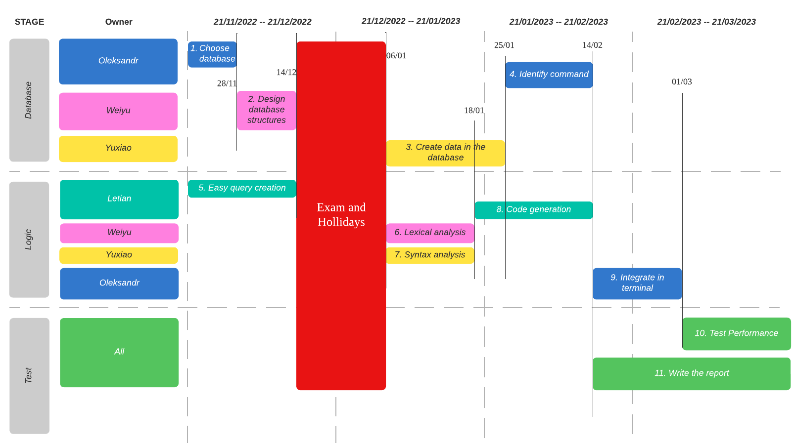

### Initial Tasks

| Tasks                          | Duration | Dependencies |    Owner  |
| ------------------------------ | -------- | ------------ | --------- |
| 1. Choose the database         | 1        |              | Olexsandr |
| 2. Design database structure   | 4        | 1            | Weiyu     |
| 3. Create data in the database | 4        | 1,2          | Yuxiao    |
| 4. Identify SQL command        | 2        | 1,2,3        | Olexsandr |
| 5. Easy query creation         | 3        |              | Letian    |
| 6. Lexical Analysis            | 3        | 5            | Weiyu     |
| 7. Syntax  Analysis            | 3        | 5            | Yuxiao    |
| 8. Code Generation             | 4        | 6, 7         | Letian    |
| 9. Integrate in terminal       | 4        | 8            | Olexandr  |
| 10. test the performace        | 2        | 9            | All       |
| 11. write the report           | 4        |              | All       |

### Gantt Chart
We have four group members. Olexsandr has many years working experience, so it is suitable for him to integrate programs and fix bugs. Yuxiao has experience in database and Weiyu is expert in design. Letian is good at programming. Therefore, we may assign Letian with the programming job, assign Yuxiao with the database query and some syntax analysis, assign Weiyu with database design and lexical analysis, and assign Oleksandr with the integration job and assistance with the other group members.

As the database design part and logic programming part can be processed without conflict. We decide to separate group members to do database design and logic programming at the same time. Some tasks cannot be executed until its dependencies are implemented. In addition, we also need to leave the time for holidays.

